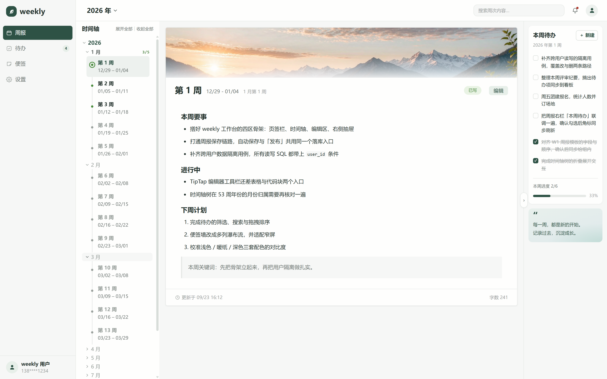
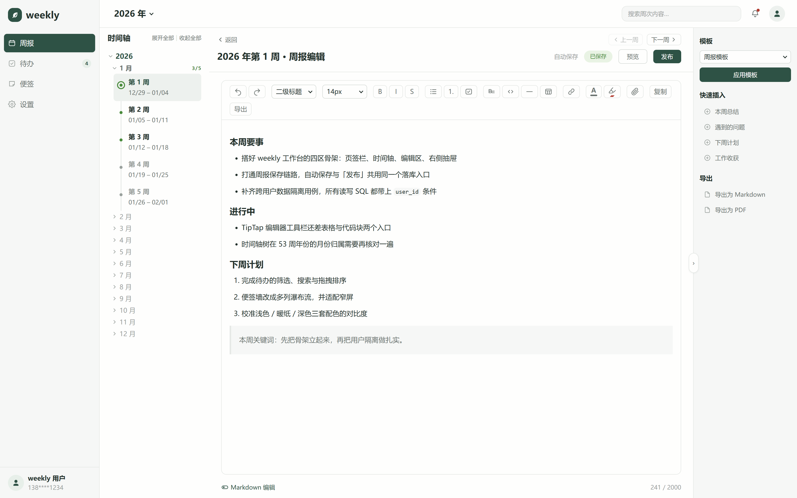
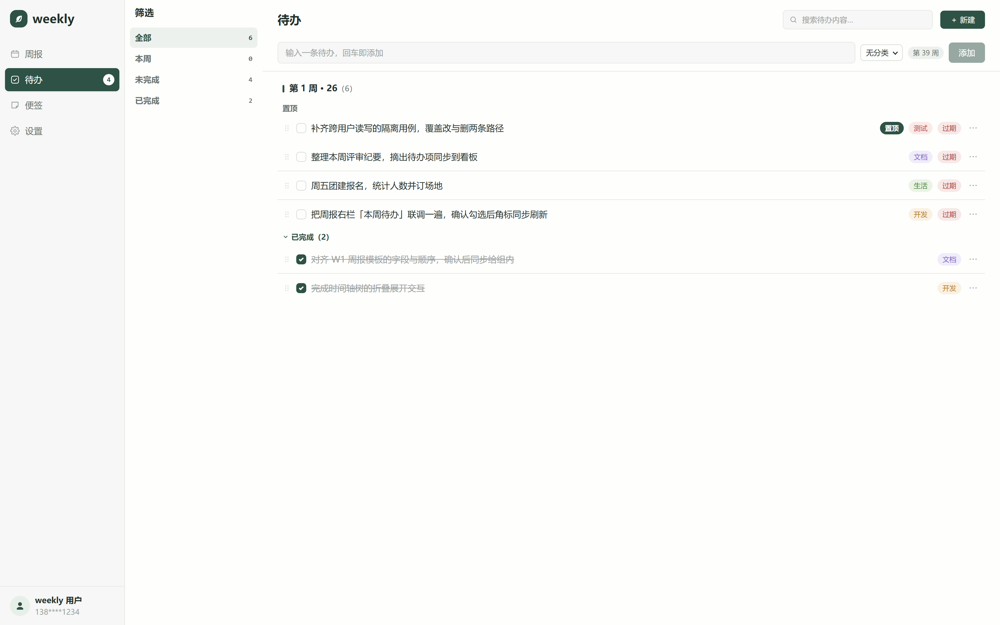
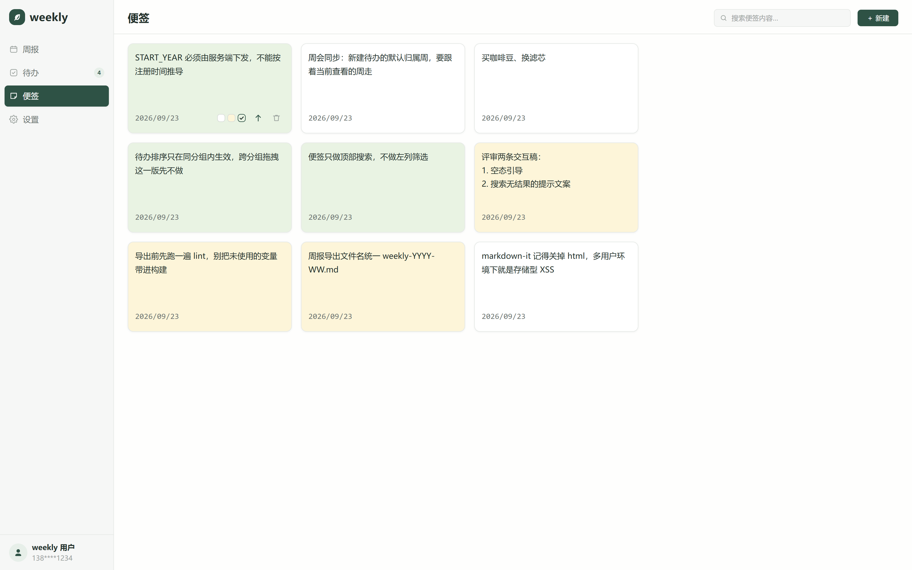
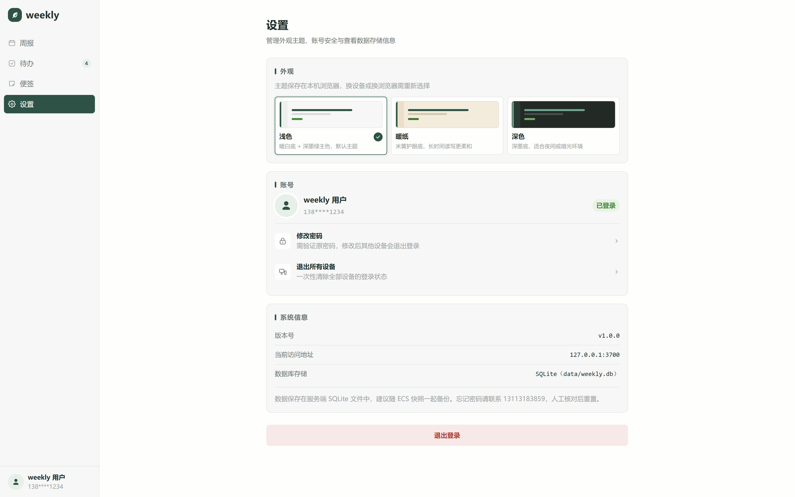

# weekly

以周为单位的工作记录工具。三个**互相独立**的模块，可以只用其中一个：

- **周报**　按 ISO 周组织，时间轴固定从 2026 年第 1 周开始。一周一篇，写多写少自己决定，不强制日更。
- **待办**　独立清单，条目可选标记所属周；标记到某一周的条目会出现在该周周报的右栏「本周待办」里。
- **便签**　纯文本碎片记录，多列便签墙，卡内直接编辑；不分组、不标周次，置顶优先、新的在前。

**多用户**：注册即用。每个账号的周报、待办、便签都按 `user_id` 完全隔离，互不可见。

部署形态：单台阿里云 ECS，Nginx 托管前端静态产物并把 `/api` 反代到内网的 Fastify 服务，数据落在 `data/weekly.db`。

---

## 截图

### 登录 / 注册

`/login`，登录与注册同页切换，未登录访问受保护路径会重定向到这里并带上原路径。


### 工作台 · 周报

`/weekly/:year/:week`。左列是「年 > 月 > 周」三层时间轴（已写的周带绿色角标，未写的周为灰色但在树中依然可见），
中栏是当前周内容，右栏是标记到本周的待办。下面两张分别是展示态与编辑态。





### 工作台 · 待办

`/todo`。单一清单 + 状态分组（置顶 / 未完成 / 已完成），左侧四选一筛选带计数：全部 / 本周 / 未完成 / 已完成。



### 工作台 · 便签

`/notes`。多列瀑布流，列数随窗口宽度自适应；三种便签纸色，点击卡片直接写，顶部搜索本地过滤。



### 设置

`/settings`。外观主题（浅色 / 暖纸 / 深色）、修改密码、登出与退出所有设备、数据备份说明。



---

## 技术栈

| | 选型 |
|---|---|
| 运行时 | Node.js 22 LTS + TypeScript |
| Web 框架 | Fastify |
| 数据库 | SQLite（`better-sqlite3`，WAL 模式）+ 手写 SQL |
| 密码与会话 | argon2 哈希；自建 token + `session` 表（HttpOnly + SameSite=Strict Cookie，30 天） |
| 日期处理 | dayjs + isoWeek 插件 |
| 构建工具 | Vite |
| 前端框架 | React 19 + React Router |
| 样式 | CSS Modules + SCSS，三套主题由 CSS 变量驱动 |
| Markdown | 编辑用 TipTap（所见即所得，底层仍存 Markdown），预览用 markdown-it |
| 数据请求 | 原生 fetch + 薄封装 |
| 包管理器 | npm |

刻意不引入：ORM、JWT、状态管理库、UI 组件库、Tailwind、axios / react-query。
手写 SQL 是为了让 `user_id` 条件一眼可见（见下方「设计约束」）。

---

## 目录结构

```
weekly/
├── server/                 # Fastify API 服务
│   ├── src/
│   │   ├── db/             # 所有 SQL 集中于此，便于审计 user_id
│   │   ├── routes/         # 路由层：只做参数校验与组装，不写 SQL
│   │   ├── middleware/     # 会话校验（注入 user_id）、登录 / 注册限流
│   │   ├── utils/          # 密码、令牌、响应封装
│   │   ├── constants.ts    # START_YEAR、周次上限等
│   │   └── index.ts
│   └── test/               # 跨用户访问测试（node --test）
├── web/                    # React SPA
│   └── src/
│       ├── pages/          # 5 条路由对应页面
│       ├── components/     # 组件与同名 .module.scss 成对出现
│       ├── api/            # fetch 薄封装
│       ├── utils/          # ISO 周次计算与格式化
│       └── styles/         # variables.scss 设计变量
├── deploy/                 # 部署材料（systemd / Nginx / 备份脚本）
├── doc/weekly-PRD.md       # 需求文档
├── data/weekly.db          # SQLite 数据库文件
├── start.ps1               # Windows 开发环境一键启动
└── AGENTS.md               # 代码与数据库约束
```

---

## 本地运行

前置：Node.js 22 LTS、npm。

### 一键启动（Windows）

```powershell
.\start.ps1
```

脚本会依次检查 Node、按需从 `.env.example` 生成根目录 `.env`、在缺失时安装 `server/` 与 `web/` 的依赖，
然后开两个新窗口分别启动后端与前端。依赖已就绪时用 `.\start.ps1 -NoInstall` 跳过安装检查。

### 手动启动

```bash
# 终端 1：后端
cd server
npm install
npm run dev

# 终端 2：前端
cd web
npm install
npm run dev
```

- 前端固定跑在 <http://127.0.0.1:3700>，开发态把 `/api` 代理到后端，前后端同源，因此不需要 CORS。
- 后端端口由根目录 `.env` 的 `PORT` 决定（`.env.example` 默认 3000）。**改端口只需改这一处**，前端的代理目标会自动跟随。

### 测试

```bash
cd server
npm test
```

用 `node --test` 跑 `db/` 层的跨用户访问测试：拿 A 的会话去改 / 删 B 的记录 id，必须失败——这是本系统最严重的单点风险，不可省略。

---

## 环境变量

前后端共用根目录的 `.env`（已被 `.gitignore` 排除，不提交）。复制 `.env.example` 即可。

| 变量 | 说明 | 默认 |
|---|---|---|
| `PORT` | 后端监听端口，同时决定前端开发代理的转发目标 | `3000` |
| `HOST` | 监听地址，保持 `127.0.0.1`，改成 `0.0.0.0` 会让 Node 直接暴露公网 | `127.0.0.1` |
| `DB_PATH` | 数据库文件路径，相对路径以仓库根目录为基准 | `data/weekly.db` |
| `NODE_ENV` | 生产环境必须为 `production` | `development` |
| `SESSION_DAYS` | 会话有效期，必须与 `session` 表的 `expires_at` 保持一致 | `30` |
| `MAX_WEEK` | ISO 周次上限，不可改 | `53` |
| `START_YEAR` | 时间轴起点年份，不可改 | `2026` |
| `REGISTER_LIMIT_PER_HOUR` | 同 IP 每小时注册上限，防批量灌水 | `10` |

---

## 部署

`deploy/` 下是三份部署材料：

| 文件 | 说明 |
|---|---|
| `weekly.service` | systemd 单元。`WorkingDirectory` 必须是 `server/`，否则相对路径形式的 `DB_PATH` 会解析错；改完执行 `systemctl daemon-reload && systemctl restart weekly` |
| `nginx.conf` | 托管 `web/dist` 并回退 SPA 路由，`/api` 反代到内网端口。必须透传 `X-Real-IP`，否则后端限流拿到的是 `127.0.0.1`，所有用户共用一个额度 |
| `backup.sh` | 用 `VACUUM INTO` 生成一致性快照（WAL 模式下不能直接 `cp` 数据库文件），并清理超期备份 |

构建：

```bash
cd server && npm run build     # 产出 dist/，systemd 用 node dist/index.js 启动
cd web && npm run build        # 产出 web/dist/，由 Nginx 托管
```

---

## 设计约束

三条不可违反的红线，完整说明见 `AGENTS.md`：

1. **每一条 SQL 都带 `user_id`**，且 `user_id` 只能从服务端会话推导，绝不接受前端传入。所有 SQL 集中在 `server/src/db/`，写操作一律写成 `WHERE id = ? AND user_id = ?`，并用 `changes > 0` 判断是否真的改到了行。
2. **Markdown 渲染必须开启 HTML 转义**：markdown-it 固定 `html: false`，React 侧不使用 `dangerouslySetInnerHTML`。多用户环境下这是一条存储型 XSS 的防线。
3. **时间轴起点固定 2026、周次上限 53**，由服务端强制校验。两个容易踩的实现细节：起点校验要按「周」判定而不是按日期（2026 年第 1 周的周一落在 2025-12-29），周数上限是 53 而不是 52（写死 52 会丢掉每年的最后一周）。

---

## 文档

| 文件 | 说明 |
|---|---|
| `doc/weekly-PRD.md` | 产品需求文档，唯一事实来源 |
| `AGENTS.md` | 代码规范、目录与命名约定、设计变量 |
| `ui.png` | 界面设计稿 |
